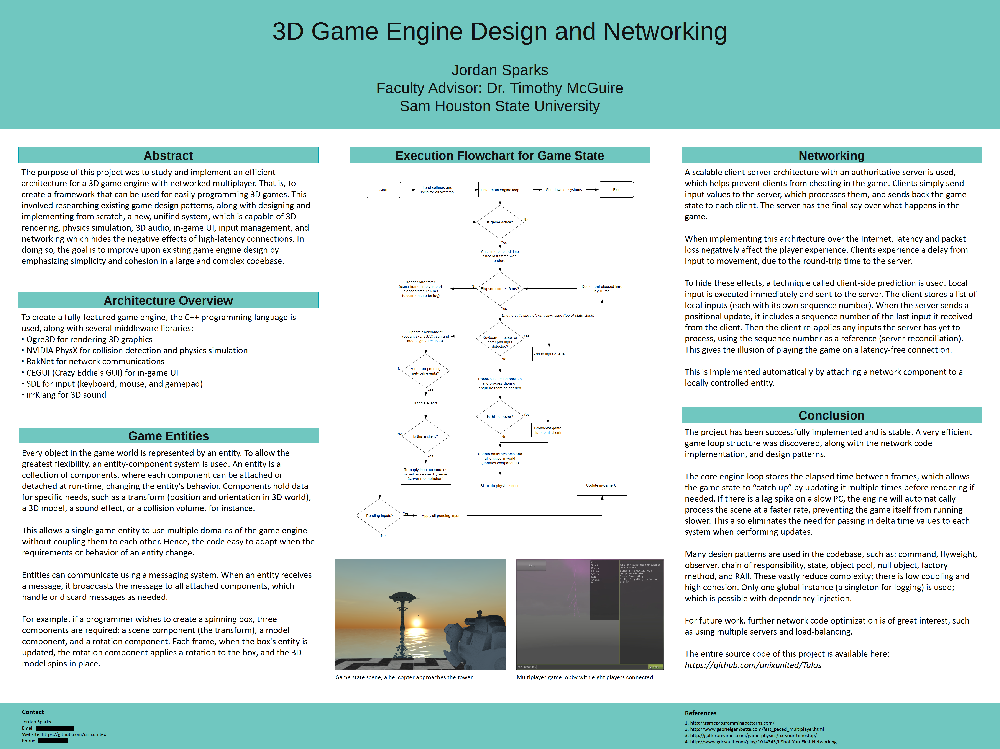
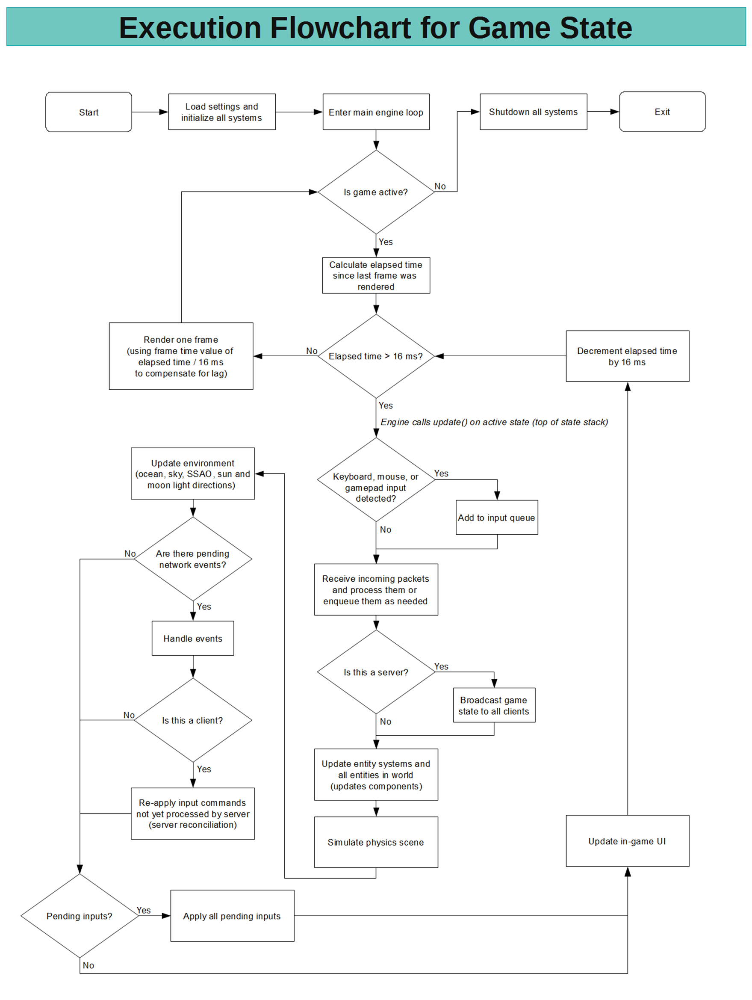

### Talos

* Hierarchical design to minimize complexity, control flow, and data flow
* Scalable networked multiplayer with high-latency mitigation using client-side prediction (RakNet)
* Ogre3D integration with NVIDIA PhysX - static/dynamic object support
* Kinematic character controller for world navigation (using NVIDIA PhysX)
* Fundamental first-person shooter mechanics; player-world interaction
* UI implementation using CEGUI, chat support for multiplayer
* Gamepad input support for first-person camera
* 3D sound support using irrKlang

===========================================================

Note: Exeuction flow chart was provided for presentation purposes - for those I talked to not familiar with game loops

